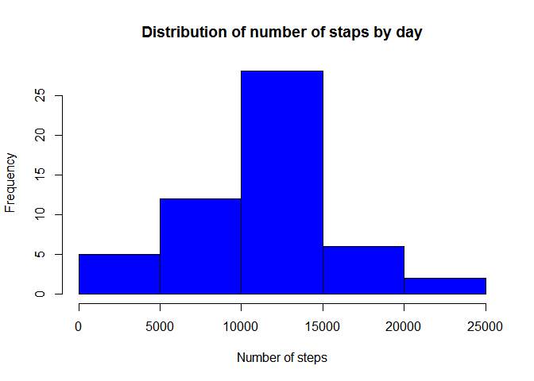
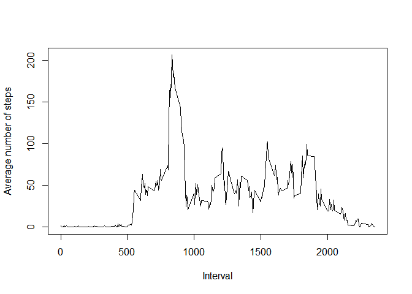
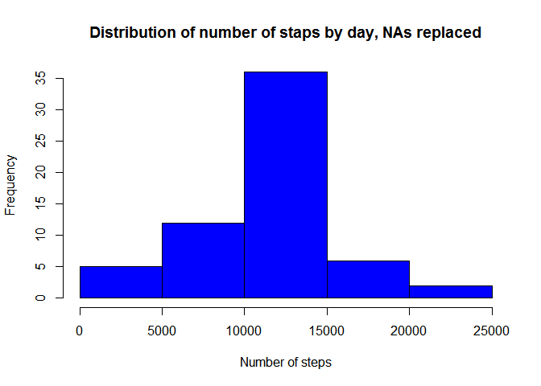
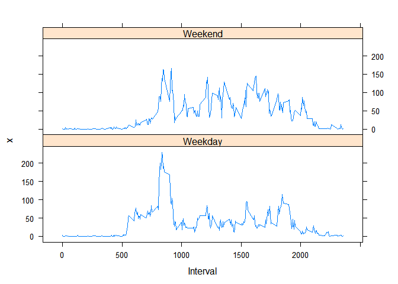

# Reproducible Research: Peer Assessment 1

## Loading and preprocessing the data
First we're going to check if the csv file already exists in the folder, and if not get it from the activity.zip file.

```r
if (!file.exists("activity.csv")) {
    unzip("activity.zip")
}
```

Now we have our csv file ready, we can load it in R. The dates are converted to the date format using the as.Date() function.

```r
activity <- read.csv("activity.csv"
                 , header=TRUE
                 , sep=","
                 , na.strings="NA"
                 , colClasses=c("numeric","character","numeric"))
activity$date <- as.Date(activity$date)
head(activity)
```

```
##   steps       date interval
## 1    NA 2012-10-01        0
## 2    NA 2012-10-01        5
## 3    NA 2012-10-01       10
## 4    NA 2012-10-01       15
## 5    NA 2012-10-01       20
## 6    NA 2012-10-01       25
```

## What is mean total number of steps taken per day?
The activity data frame contains one entry for each 5-minutes interval. Let's aggregate the values to have the total amount of steps for each day

```r
stepsbyday <- aggregate(activity$steps ~ activity$date
                        , activity
                        , FUN="sum"
                        , na.rm=TRUE)
colnames(stepsbyday) <- c("date", "steps")
```

By using the hist() function we can see the distribution of the amount of steps taken by day.

```r
hist(stepsbyday$steps
     , col="blue"
     , xlab="Number of steps"
     , main="Distribution of number of staps by day")
```

 

The mean and median number of steps taken each day are given by the following functions:

```r
mean(stepsbyday$steps)
```

```
## [1] 10766.19
```

```r
median(stepsbyday$steps)
```

```
## [1] 10765
```

## What is the average daily activity pattern?
As for the previous section, we have to aggregate the data to get the mean number of steps for each interval over the whole covered period.

```r
dailypattern <- aggregate(activity$steps ~ activity$interval
                          , activity
                          , FUN="mean"
                          , na.rm=TRUE)
colnames(dailypattern) <- c("interval","steps")
```

Now we can plot the average daily activity pattern using the plot function

```r
plot(dailypattern$interval
     , dailypattern$steps
     , type="l"
     , xlab="Interval"
     , ylab="Average number of steps")
```

 

The interval with the highest number of steps (on average) is given by

```r
dailypattern[dailypattern$steps==max(dailypattern$steps),]
```

```
##     interval    steps
## 104      835 206.1698
```

## Imputing missing values
The original dataset contains several intervals where the value is missing. These can be counted using this formula :

```r
sum(is.na(activity))
```

```
## [1] 2304
```

As these missing values might introduce bias let's replace the NAs by the average value of the related interval (from the dailypattern data frame).
For this we'll first make a left join of the activity data frame with the dailypattern dataframe to add the average number of steps for each interval. Then we'll replace the NA values in the original steps column by the average value, taken from the newly created row.

```r
activity <- merge(activity,dailypattern,by.x='interval',by.y='interval')

filter <- which(is.na(activity$steps.x))
activity$steps.x[filter] <- activity$steps.y[filter]

# tidying...
activity <- activity[,-4]
colnames(activity[2]) <- c("steps")
head(activity)
```

```
##   interval  steps.x       date
## 1        0 1.716981 2012-10-01
## 2        0 0.000000 2012-11-23
## 3        0 0.000000 2012-10-28
## 4        0 0.000000 2012-11-06
## 5        0 0.000000 2012-11-24
## 6        0 0.000000 2012-11-15
```

We can now recompute the histogram of the total number of steps for each day, and the mean and median total number of steps taken per day

```r
stepsbyday2 <- aggregate(activity$steps ~ activity$date
                        , activity
                        , FUN="sum"
                        , na.rm=TRUE)
colnames(stepsbyday2) <- c("date", "steps")

hist(stepsbyday2$steps
     , col="blue"
     , xlab="Number of steps"
     , main="Distribution of number of staps by day, NAs replaced")
```

 

```r
mean(stepsbyday2$steps)
```

```
## [1] 10766.19
```

```r
median(stepsbyday2$steps)
```

```
## [1] 10766.19
```

## Are there differences in activity patterns between weekdays and weekends?
The wday component of the POSIXlt objects gives the numeric value of the week day (0 for Sunday, 1 for Monday, 2 for Tuesday...). Let's use this property to create a factor that will separate the week days from the weekend days.

```r
isWeekday <- as.factor(ifelse(as.POSIXlt(activity$date)$wday %in% c(0,6)
                              , "Weekend"
                              , "Weekday"))
activity <- cbind(activity,isWeekday)
dailyPatternWeekdays <- aggregate(activity$steps
                                 , list(Interval = activity$interval
                                        , isWeekday = activity$isWeekday)
                                 , FUN="mean"
                                 , na.rm=TRUE)
head(dailyPatternWeekdays)
```

```
##   Interval isWeekday          x
## 1        0   Weekday 2.25115304
## 2        5   Weekday 0.44528302
## 3       10   Weekday 0.17316562
## 4       15   Weekday 0.19790356
## 5       20   Weekday 0.09895178
## 6       25   Weekday 1.59035639
```

Now let's plot these values to see if there's a different behaviour during the weekdays than during the weekends.

*Please note this assumes you have installed the lattice package on your computer. If you haven't, you can install it by using the "install.packages(lattice)" command.*

```r
library(lattice)
with(dailyPatternWeekdays, xyplot(x ~ Interval | isWeekday, layout=c(1,2), type="l"))
```

 
